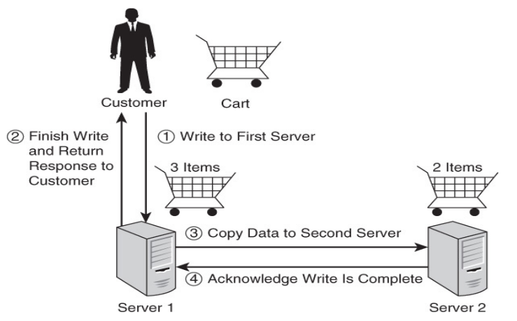
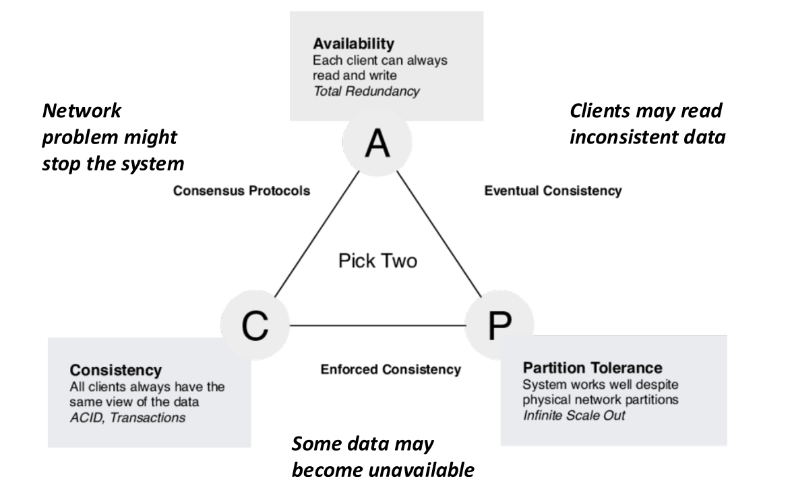
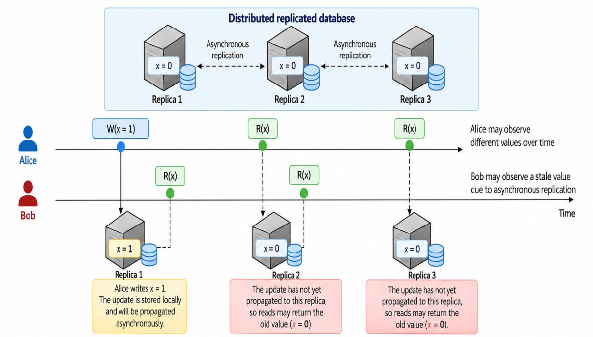

# 1. Index

- [1. Index](#1-index)
- [2. ACID vs BASE](#2-acid-vs-base)
  - [2.1. Data Proprieties](#21-data-proprieties)
  - [2.2. The CAP Theorem - Brewer's Theorem](#22-the-cap-theorem---brewers-theorem)
    - [2.2.1. CA Solutions](#221-ca-solutions)
    - [2.2.2. AP Solutions](#222-ap-solutions)
    - [2.2.3. CP Solutions](#223-cp-solutions)
    - [2.2.4. Network Partition Resilience](#224-network-partition-resilience)
  - [2.3. BASE Properties of NoSQL Databases](#23-base-properties-of-nosql-databases)
  - [2.4. Eventual Consistency and the Latency Issue](#24-eventual-consistency-and-the-latency-issue)

# 2. ACID vs BASE

Databases must allow users to store and retrieve data.

To do so, three tasks must be implemented by the DBMS:

- **Persistence of Data**: the DBMS must ensure that data is stored
  permanently and can be retrieved even after a system crash or power failure.
- **Maintenance of Data Integrity**: the DBMS must ensure that data is
  consistent and accurate.
- **Data Availability**: the DBMS must ensure that data is accessible to users
  at all times.

Most of the recent NoSQL DMBSs can be deployed and used on **distributed systems**,
namely on _multiple servers_ rather than a single machine.
The _servers_ are connected to each other through a server, and they often
share the same chunks of data, allowing for _replication_ and _redundancy_.

This architecture has some _pros_ and _cons_:

PROS

The distributed architecture ensure:

- **Horizontal scalability** (which makes it easier to add or remove more nodes
  rather than add upgrade a single machine)
- **Flexibility**: it allows not to prior describe the schema of the data
- **Cost control**
- **Availability**:
- **Fault Tolerance**: if a node fails, the system can still operate using the
  other nodes

CONS

There is a non irrelevant _overhead_ to **balance** the requirements of **data
consistency** and **availability** in a distributed system.

When we update some data, to ensure _high availability_, we must find a way to keep
all the distributed chunks updated at all time.

On the other hand, if we allow to have less availability, we can allow the
chunks to not be consistent at all time, maybe introducing **network partitioning**.

## 2.1. Data Proprieties

Basic data properties that a database must ensure are:

- **Persistence**: Data must be stored in a way that is not lost when the
  database server is shut down.
- **Consistency**: A transaction can only bring the database from one valid
  state to another.
- **Integrity**: Data _consistency_ must be **maintained** for all inserts/update
  operations.
- **Replication**: Data is maintained on multiple _backup nodes_ to ensure
  that it stays available even when the _primary node_ fails.

The introduction of replication makes it harder to talk about _consistency_ and
_integrity_.

An example of this is the one shown on the right.

When someone makes a write on the primary server, we can consider the transaction
concluded when the write has been propagated and acknowledged by all the backup
nodes.

This is called **Two-Phase Commit** and it ensures the _highest level of consistency_.

A drawback of this approach is that it **increases the latency** of operations,
since the write is now to be propagated to all the $k$ backup nodes.

At the same time, also read operations will be slowed down, since the user
must wait for the data to be consistent on all servers.

If we want to have an higher level of availability, losing some consistency,
we can do something different.

Instead of making the customer wait for the data propagation to the backup nodes,
we can return control right after the write has been made on the primary node.

After that, there will be a server-side thread that will asynchronously
propagate the write to the backup nodes.

This is called **Eventual Consistency**, we allow the nodes to have different
states for known period of time, still ensuring consistency in the long run.

A possible drawback of this approach is that, in case of unavailability of the
primary node, the user may be unknowingly redirected to a backup node that has not
yet received the latest state. This means that the user will read **an old value**
of the data.

This is acceptable in many scenarios (social networks, e-commerce, etc.) but
_unthinkable_ in others (banking, stock exchange, etc.).

## 2.2. The CAP Theorem - Brewer's Theorem

Distributed Databases cannot ensure at the same time:

- **Consistency (C)**: The presence of consistent copies of data on different servers
- **Availability (A)**: The immediate response provision to any query
- **Partition Protection (P)**: Failure of individual nodes/connections
  between nodes do not impact the system as a whole.

At maximum **two** of the previous features may be found in a distributed database.

### 2.2.1. CA Solutions

In a normal distributed system all nodes are in contact and data is consistently
replicated throughout the nodes, meaning that during propagation access to
data is blocked.

When a **Network Partitioning** takes place, dividing the system into two or more
partitions not in contact with each other, the systems **_blocks all operations_**
to preserve consistency.

This way:

- **Consistency**: All clients see the same up-to-date data.
- **Availability**: As long as no partition occurs, every request receives a response.
- **Partition Tolerance**: The system is not tolerant to network partitions.

During Partitioning all nodes cannot communicate. To preserve consistency, both
read and write are blocked for everyone, making the system **unavailable** until
the partition is resolved.

This is typically used where strong consistency is essential (banking,
finance, etc.) or in single-site or tightly-coupled distributed systems,
where network partitions are rare and considered exceptional events.

### 2.2.2. AP Solutions

In a normal distributed system all nodes are in contact and data is consistently
replicated throughout the nodes, meaning that during propagation access to
data is blocked.

When a **Network Partitioning** takes place, dividing the system into two or more
partitions not in contact with each other, the systems **_allows all operations_**
but **suspends synchronization**.
In this architecture, read operation may provide not yet updated data coming from
the other partition.

This way:

- **Availability**: Every request receives a response, even during a partition.
- **Partition Tolerance**: The system continues to operate despite network partitions.
- **Consistency**: Some data returned may be _inaccurate_ (_stale_), compromising
  consistency.

During Partitioning writes are accepted and stored locally. Since replicas cannot
exchange data, they may diverge and become inconsistent, making reads return stale
data. When the partition is resolved, the system will synchronize the replicas using
something like _journals_, implementing the _eventual consistency_ model.

This is typically used in shopping carts, new publishing CMS or systems that need
to work in spite of external errors.

### 2.2.3. CP Solutions

In a normal distributed system all nodes are in contact and data is consistently
replicated throughout the nodes, meaning that during propagation access to
data is blocked.

When a **Network Partitioning** takes place, dividing the system into two or more
partitions not in contact with each other, the systems **_preserves consistency,
allowing only some operations to some partition_**.
In this architecture, the partition which the higher number of nodes will still
be able to accept some requests, while the other will be blocked.

This way:

- **Consistency**: All clients see the same up-to-date data.
- **Partition Tolerance**: The system continues to operate despite network partitions.
- **Availability**: During a partition, some operation may be blocked.

During Partitioning a majority of nodes remains available, allowing to user connected
to them to read and write consistent data. Instead, nodes in the _minority partition_
cannot process operations (they are blocked) to avoid returning inconsistent data.
When the partition is resolved, the system will synchronize the replicas using
something like _journals_, implementing the _eventual consistency_ model.

This is typically used in applications that require consistency and partition tolerance,
allowing for longer response times (e.g., Bank ATMs).
This architecture is usually based on _distributed and replicated relational/NoSQL
systems_.

### 2.2.4. Network Partition Resilience

If we want to have _partition resilience_, when a partition occurs the system
administrator has two choices:

- **AP side**: Show each user a different view of the data (availability but not
  consistency).
- **CP side**: shut down one of the partitions and disconnect one of the users
  (consistency but not availability).

## 2.3. BASE Properties of NoSQL Databases

The acronym **BASE** stands for:

- **Basically Available (BA)**: partial failures of the distributed databases
  may be handled in order to ensure _service availability_. It's often used
  _data replication_.
- **Soft state (S)**: Data stored in the nodes may be _updated_ with more
  recent data because of the _eventual consistency_ model.
- **Eventually consistent (E)**: At some point in the future, data in all nodes
  will converge to a _consistent state_.

## 2.4. Eventual Consistency and the Latency Issue

To achieve **High Availability**, a strong requirement of modern shared-data
systems, data and services must be _replicated_.
This replication impose **consistency maintenance** and **synchronization** between
the nodes. These operations introduce higher latency.

Eventual consistency allows to _distribute this latency_ over time, making the system
_faster_ from the user's point-of-view, at the cosy of him receiving _stale data_.

There are several types of _eventual consistency_:

- **Read-Your-Writes Consistency**: Ensures that once a user has updated a
  record, all of his/her reads of that record will return _the updated value_,
  even if the write has not yet been replicated to all the nodes.
- **Session Consistency**: Ensures "read-your-writes consistency" _during a
  session_. If the user ends a session and starts another session, even if
  with the same DBMS, **there is no guarantee** the server will "remember" the
  writes made in the previous session.
- **Monotonic Read Consistency**: Ensures that if a user issues a query and sees
  a result, all the users will never see an earlier version of the value.
- **Monotonic Write Consistency**: Ensures that if a user makes several update
  commands, they will be executed in the order their are issued. A possible
  implementation of this is to make all the _writes_ go through a single node,
  while saving them into a queue. The writes will later propagate the updates
  by following the queue order.
- **Causal Consistency**: If an operation causally depends on a preceding operation
  (there is a causal relationship between the operations), it ensures that users
  will observe results _consistent with the causal relationships_.

It's different from _monotonic write consistency_ because it allows the
propagation of writes to be executed in different order **as long as they are
not casually related**.

An example of this can be found in social networks comments:

- Monotonic Write Consistency says that the comments must be propagated in the
  order they are written.
- Casual Consistency says that if a comment is a reply to another comment, it
  must be propagated after the original comment, but two different unrelated comments
  to the same post can be propagated in any order.
