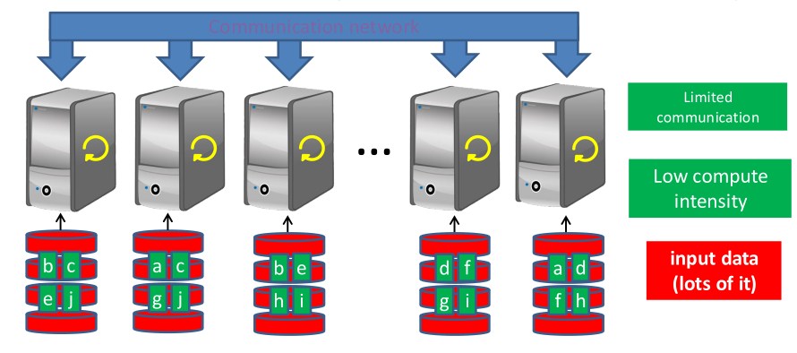
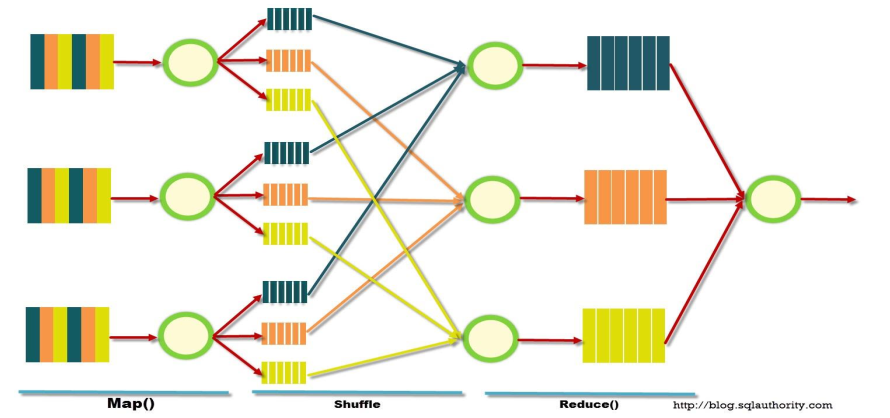
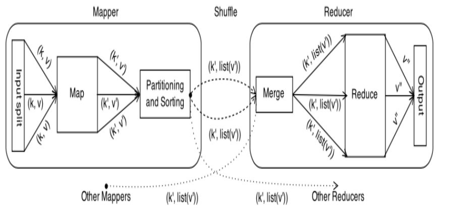
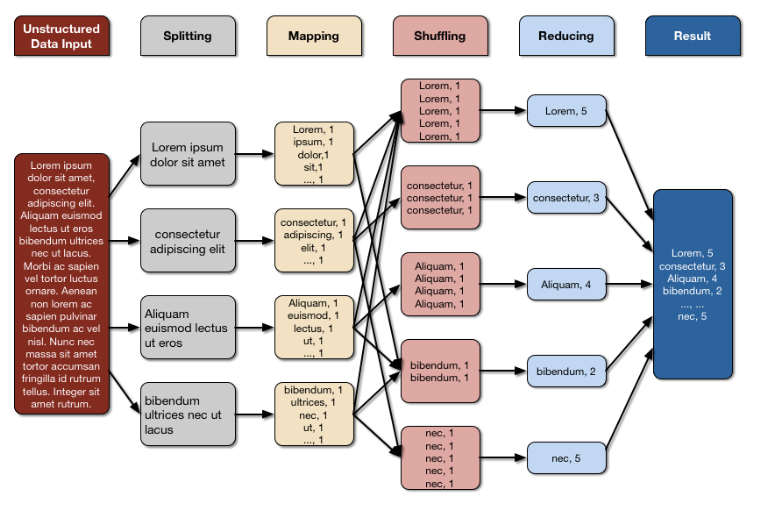

# 1. Index

- [1. Index](#1-index)
- [2. Big Data](#2-big-data)
  - [2.1. Deal with Big Data](#21-deal-with-big-data)
    - [2.1.1. `MapReduce`](#211-mapreduce)
    - [2.1.2. `Hadoop`](#212-hadoop)
    - [2.1.3. `Apache Spark`](#213-apache-spark)

# 2. Big Data

Big Data is nothing more than a fashion-trend **buzz word**.

The work _"Big Data"_ refers to:

> Any problem characteristic that represents a **challenge** to process it with
> _traditional applications_.
> It involves **data** whose volume, diversity and complexity requires **new techniques,
> algorithms and analysis** to fetch, store and elaborate them.

They are produced in several different ways:

- Using social media and networks
- Using Scientific Instruments and sensor technology/network
- Through mobile devices
- From Transactions or Genomics informations

In general, the main source of information is **The Internet**

At the beginning, _Big Data_ were defined through the _5-Vs_:

1. **Volume**: it is huge amount of data
2. **Veracity**: There are inconsistencies and uncertainty in data
3. **Velocity**: They are accumulated with high speed
4. **Value**: They are useful data, that will still be relevant in several time
5. **Variety**: They are in different formats from various sources.

Later, the definition become the _10 Vs_, extending the existing five
with five more:

1. **Validity**: The data is valid and comes from quality sources
1. **Variability**: The data are dynamics and/or follows evolving behavior of
   the source
1. **Venue**: The data is distributed heterogeneously from multiple platforms
1. **Vocabulary**: The data follows models, and can be described following
   certain semantics
1. **Vagueness**: similar to Veracity

In 2017 the definitions expanded further becoming the _42 Vs_.

## 2.1. Deal with Big Data

The practical aspects to consider when dealing with Big Data are:

- **Acquisition**: actually collect the data
- **Storage**: the huge moles of data must be saved somewhere
- **Computation Infrastructure**: We have to understand how to actually
  use the data, since classical data elaboration algorithms cannot directly be applied.
- **Databases/Querying**: We must find a fast and efficient way to extract the
  wanted data
- **Analytics/Mining**: We should find a way to efficiently use the model to
  perform analysis and training
- **Visualization**: find a way to actually see the data
- **Security and Privacy**: The data can contain sensible informations that
  must be kept private.

Therefore, to be able to handle them, new technologies and paradigms are
needed for storage, designing, implementing and experimenting algorithms.

Two techniques to deal with data intensive applications are:

- **Scale-Up**: going from a small infrastructure to a bigger one. This has
  several problem:
  - _Single-Point-of-Failure_: having everything on one source means that any
    problems of it means the failure of the whole system
  - _Outages_: during the moving of the data from the small architecture to
    the large one, the services won't work.
  - _Costs_: Buying a bigger architecture almost always cost more than buying
    two or three copies of the original architecture
- **Scale-Out**: Instead of going from a small to a big architecture, we use
  **clusters** of small infrastructure, in order to be able to add/remove units
  depending on the trend of the requests, keeping reasonable costs. This also
  has some problems like understanding how to navigate and handle the
  distributed data.

Several big provider like Google and Meta understood hat the way-to-go when
talking about big data is the **horizontal scaling**.

Through, distributed systems bring a new challenge: **applying operation to
all data**.
Since one machine cannot process or store all data, the data is distributed in
a _cluster of computing nodes_. From the user point-of-view, it **does not
matter** which machine executes the operation, nor if the operation runs twice
in different nodes (can happen because of failures or straggler nodes), as he
looks for an **abstraction of the complexity** behind these kind of systems.

The only crucial point of distributed systems in Big Data is the **Data Locality**,
as we need to avoid data transfers between machines as much as possible.

The typical solution implemented in practice is the one shown on the right.

The idea is to have a distributed file system, so a distributed set of data
structures and methods used by applications to handle data.

Each time we upload some new data, the infrastructure divides it in different
chunks/blocks.
Each chunk/block is then saved **into several different computing nodes**,
adding redundancy to it.  
One important thing we have to keep in mind is that **different chunks of the
same file are not necessarily saved onto the same disk**.

### 2.1.1. `MapReduce`

Is one of the most famous programming paradigm introduced by Google in 2004 to
implement the distributed architecture we just described.

The idea is the following:

- Data divided into chunks, which will be distributed among nodes
- Functions/operations to process data are distributed to all the computing nodes
- Each computing nodes works with the data stored in it.
- **Only the necessary data is moved across the network**.

It implements a _Parallel Programming Model_, using a _divide & conquer_ strategy:

- **Divide (_map_)**: partition the dataset into smaller independent chunks
  to be processed in parallel
- **Conquer (_reduce_)**: combine, merge or aggregate the results from the
  previous step.

In between the `map` and the `reduce`, a `shuffle` happens, that distributes
each mapped aggregation into a specific node, in order for them to work to the
reduce in parallel.

Given the input, we first split the data into portions. For each portion the
`map` creates a key-value dictionary for each entry where the key is our
desired data, and the value is always `1`. If a data appears twice we simply
have two identical entries.
The shuffling aggregates the identical entries into singular nodes, that now
are able to perform the `reduce` in parallel creating one singular key-value
record where the value is given by the aggregation of the singular records.

At the end the result is given by the aggregations of the single `reduce` output.

<figure class="100">

<figcaption>

Scheme of basic working

</figcaption>
</figure>

The following images shows a use-case for the algorithm:

<figure class="75">

<figcaption>

WordCount Example

</figcaption>
</figure>

### 2.1.2. `Hadoop`

One of the first open-source frameworks built to process large data sets is
[`Apache Hadoop`](https://hadoop.apache.org/).
Build in Java, it consists of a number of modules:

- **Hadoop Common**: common utilities that support the other modules
- **Hadoop Distributed File System (`HDFS`)**: a distributed file-system
  written in Java that scales to clusters with _thousands of computing nodes_.
  It is _fault tolerant_ due to data replication, and is designed for _big
  files_ (from `GBs` to `PBs`) and _low-cost hardware_. Is especially efficient
  for _read_ and _append_ operations.
- **Hadoop YARN**: a framework for job scheduling and cluster resource management
- **Hadoop MapReduce**: the programming model

`Hadoop` is optimized for **one-pass batch** processing of on-disk data, which
means that the data will be loaded in memory only for the time needed for one
single the `map`-`reduce` cycle, making _iterative code_ very slow and inefficient.

Due to poor inter-communication capability and inadequacy for in-memory computation,
is not suitable for applications that require _iterative_ and/or _online computation_.

### 2.1.3. `Apache Spark`

[`Apache Spark`](https://spark.apache.org) is a newer open-source Apache
Project tool characterised with enhanced flexibility and efficiency.

It allows employing **different distributed programming models**, such as
`MapReduce` and `Pregel`, and has proved to perform _faster than `Hadoop`_,
especially in iterative and online applications.

Unlike the disk-based `MapReduce` paradigm supported by `Hadoop`, Spark employs
the concept of **in-memory cluster computing**, where datasets are _cached in memory_
to reduce their access latency. Only at the end of the running of the
application the memory will be saved into permanent memory.

At high level, the Spark applications runs as a set of **independent
processes** on top of the dataset distributed across the cluster consisting
of one driver program and several executors:

- **Driver Program**: hosted in the _primary machine_, it runs the
  user's **main function** and _distributes_ operations on the cluster by
  sending several units of work, called tasks, to the executors.
- **Executor Programs**: hosted in _secondary machines_, they run tasks in
  parallel and keeps data in memory or disk storage across them.

The main abstraction provided by Spark is the **Resilient Distributed Dataset**
(`RDD`), which is a **fault-tolerant** collection of elements partitioned across
the machine of the cluster that can be processed in parallel.

These collections are **resilient**, because they _can be rebuilt_ if a
portion of the dataset is lost.

The applications developed using this framework are **totally independent**
of the _file system_ or the _database management_ system used for storing data.

Indeed, there exist _connectors_ for reading data, creating the `RDD` and
writing back results on files/databases.

In the last years, _Data Frames_ and _Datasets_ have been released as an abstraction
on top of the `RDD`.
