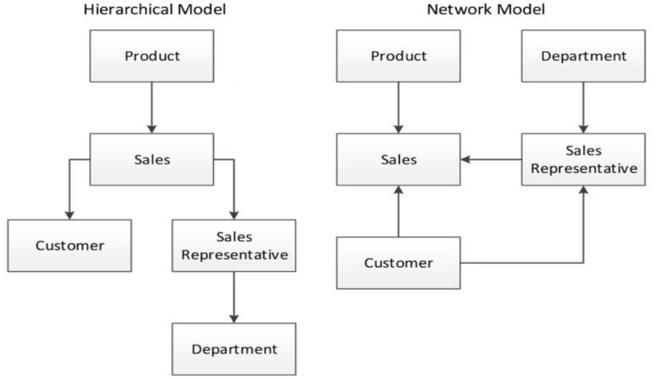

# 1. Index

# 2. Databases History

A _database_ is an **organized collection of data**.

This means that books with a strongly enforced structure, such as
dictionaries and encyclopaedias, or libraries or any other indexed archives of
information can be considered as databases.

Technically, since a loom creates complex fabric patterns, "storing" them on
the fabric, we can also consider a loom as a very weird kind of database.
Similarly, we can categorize as databases also _perforated paper strip_ for
musical boxes or _punched cards_ used in tabulating machines.

To name something closer to our days, after WWII data started being stored
**sequentially** adopting either _paper tape_ or _magnetic tape_.

These were easy to use and had the features "fast forward" and "rewind",
allowing to move more freely and easily across the data it contained.
The only problem it had was that it was not possible to access the data
randomly, but only sequentially.

The first electronic database was made around the 1960. It was called `OLTP`
(On-line Transaction Processing) computer system.

The main feature of this database was `ISAM` (Index Sequential Access Method),
which saved a list of pointers, identified by a key and ordered in specific
positions, that allowed to have a structure that allowed faster indexing
strategies and access time.

## Database Management Systems - `DBMS`

The creation on such databases was an incredible step forward, but it had the
huge drawback of not being portable and standardized, since there were no
**Database Management Systems** (`DBMS`).

Without a `DBMS`, each database was created for a specific application, and
was to be reinvented for each use case. This led to errors, caused by
corrupted data, sophisticated coding needed for concurrent access, complicated
and specialized optimization for data access very hard to duplicate for
different applications...

`DBMS` represented a **new layer** that allowed the separation between the
_database handling logic_ and the _application logic_, reducing programmer
overhead and ensuring performance and integrity of data access routines.

The main feature of **DBMS** are:

1. A **scheme** for the data to store in the database
2. An **access path** for navigating among the data records.

On the right we can see two different types of models for the **DBMS**:

- **Hierarchical model**: the data is organized in a tree structure, where
  each record has a single parent and can have multiple children. This model is
  efficient for certain types of queries (find a department of the sales
  representative with a specific sale) but can be inflexible for others (find a
  specific order).
- **Network model**: the data is organized in a graph structure, where each
  record can have multiple parents and multiple children. This model is more
  flexible than the hierarchical model, but can be more complex to implement
  and maintain.

These Navigational Models had several issues:

- They ran exclusively on the mainframe computer systems of the day
  (largely IBM mainframes)
- They supported only queries that could be anticipated during the
  initial design phase
- It was extremely difficult to add new data elements to an existing system
- `CRUD` (_Create_, _Read_, _Update_, _Delete_) operations oriented, which meant
  that complex analytic queries required hard coding

## Relational Theory

In recent times the business demanded for **analytic-style reports**. The
existing databases were **to hard** to use, and lacked a theoretical
foundation, mixing logical and physical implementations.

In 1970 _Edgar Codd_ wrote in his paper "A Relational Model of Data for
Large Shared Data Banks" the first formal discussion on the **Relational Theory**.

The main features were:

- **Tuples**: an unordered set of attribute values. In a database system, a tuple
  corresponds to a row, and an attribute to a column value.
- **Relations:** collections of distinct tuples and correspond to tables in
  relational database implementations.
- **Constraints:** enforce consistency and integrity of the database. (types,
  values, formats, ...)

He formalized that operations on relations (like joins, projections,
unions) must always return relations. In practice, this means that a query on
a table returns data in a tabular format.

Apart from _value constraints_, he also introduced **Key (Integrity)
Constraints**:

- **Primary Key**: uniquely identifies each row in a table (no duplicates, no nulls)
- **Foreign Key**: links to a primary key in another table, enforcing
  referential integrity
- **Unique Key**: ensures uniqueness in a column or set of columns, but allows nulls

The theory also introduced the concept of **Normal Forms** of our database.
The third normal form is:

> Non-key attributes must be dependent on “the key, the whole key, and
> nothing but the key”.

### Transaction

To allow concurrent data change requests on a database system, we have to
ensure **consistency** and **integrity** of the data. In most relational databases
that appeared around the 1970s, this was done through **ACID Transactions**.

The formal definition (by _Jim Gray_) of a transaction is:

> A transaction is a transformation of state which has the properties of
> atomicity (all or nothing), durability (effects survive failures) and
> consistency (a correct transformation).

These types of transactions had to be:

- **Atomic**: The transaction is indivisible—either all the statements in the
  transaction are applied to the database or none are.
- **Consistent**: The database remains in a consistent state before and
  after transaction execution.
- **Isolated**: While multiple transactions can be executed by one or more users
  simultaneously, one transaction should not see the effects of other
  in-progress transactions.
- **Durable**: Once a transaction is saved to the database, its changes are expected
  to persist even if there is a failure of operating system or hardware.

## Relational DBMS

The SQL Language was pioneered by IBM in its System R in 1974, and was at the
center of battles between IBM and ORACLE in the 1980s.

By the mid-1980s, most of the Relational DBMS vendors had adopted SQL as their
standard query language, since the users appreciated the simplicity and
quickness of the language.

In the late 1980s development of _client-server_ architecture allowed the
separation of the database server from the application workstation, allowing for
a better scalability and performance of the database system.

This allowing to concentrate **application logic** on the client-side, leaving
within the database server only _stored procedures_ (programs that ran inside the
database).

The applications based on this new paradigm exploited relational DBMSs as
**backend**, assuming SQL as the **vehicle for all requests**.

This lead to **frustration** for object-oriented (OO) developers, since there
was not a direct mapping between the relational model and the object-oriented model,
leading to the so-called **Object-Relational Impedance Mismatch**.

To reduce this frustration, a new DBMS model was introduces, called
**Object-Oriented DBMS** (OODBMS), which allowed to store program objects
**without normalization**, allowing applications to _load and store_ objects
more easily.

The implementation of OOBDMS resembles the "Navigation" models.

However, the OODBMS model was not widely adopted, and the relational model remained
dominant. Luckily though, **Object-Relational Mapping** (`ORM`) frameworks (like
_Hibernate_) were developed to alleviate the pain of OO programmers.

## Object-Relational Mapping - `ORM`

An _Object-Relational Mapping_ (`ORM`) framework is a software library that
can help and simplify the translations between the object-oriented programming model
and the relational database model.

It can use **class** definitions (models) to create, maintain and provide full
access to objects' data and their **database persistence**.

In ORM, object are **first-class citizens**, and we map:

- Relation/Table $\Leftrightarrow$ Class
- Attribute/Column $\Leftrightarrow$ Member/Field
- Record/Row/Tuple $\Leftrightarrow$ Object
- Relationship $\Leftrightarrow$ Composition (must have) / Aggregation (can have)

## Massive Web-Scale Applications - `MWAs`

From 1995 to 2005 no significant new database was introduced.

In this period the **Internet** started to pervade the life of everyone and,
in 2005, the era of **Massive Web-Scale Applications** (`MWAs`) started to
create pressures on the relational database model.

The main actors of this kind of applications (Google, Amazon, Facebook,
Yahoo!, ...) needed:

- Large volumes of r/w operations
- Low latency response times
- High availability and fault tolerance

Although the performance of `RDMSs` may be improved by _upgrading CPUs_,
_adding more memory_ and _faster storage devices_, this vertical scaling of
the servers was **costly**, also in terms of maintenance, without considering
that a server as a limit of how many CPUs and memories it can support.

The deployment of `RDBMSs` on multiple servers is very hard to manage, and is prone
to gave several performance issues.

Finally, ACID Transactions are very hard to implement on multiple servers.

A new paradigm was needed and, since `MWSAs` served a _huge amount of users_, it
needed large-scale `DBMS` characterized by:

- **Scalability**: we should be able to add/remove new servers when needed.
- **Flexibility**: We should be able to add/remove/modify one or more
  fields which describe the items in the database when needed.
- **Availability**: The deployment should be possible on multiple servers. If
  one server goes down, the services continue to be available for users, even
  though performances (and also data consistency) may be reduced.
- **Low cost**

Since `RDBMS` were not created with these necessity in mind, and the fact that most
of them were provided with licensing costs, Companies started to use open
source `DBMSs`.

### NoSQL Databases

**NoSQL** is the acronym of _Not Only SQL_, and it considers **a set of data
models** and related software.

Most of _NoSQL_ solutions ensures _Scalability_, _Flexibility_ and
_Availability_, and are often open source, although they may not support _ACID
Transactions_.

There exists also **NewSQL Databases** which retain many features of the
relational model, but amend the underlying technology in significant ways.

## SQL on Cloud Services

Currently, scalable services for handling relational databases are offered by big
enterprises such as Google and Amazon.

These services are cloud-based and pay-per-use services. Using these services,
enterprises may continue to use their software without the needs to migrate
towards NoSQL databases, but must have to upload their data to the Cloud.

The offered solutions are often scalable up to thousands of nodes and ensure high
availability of the service.

These type of database ensures _availability_ and _scalability_, but it
reduces the _flexibility_, and can rise privacy and security issues.
