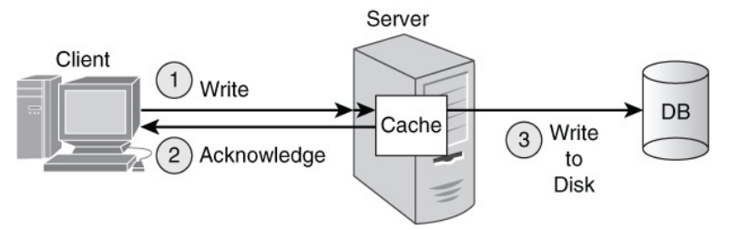

# 1. Index

- [1. Index](#1-index)
- [2. Key Value Database](#2-key-value-database)
  - [2.1. Features](#21-features)
    - [2.1.1. Simplicity](#211-simplicity)
    - [2.1.2. Speed](#212-speed)
    - [2.1.3. Scalability and Memory Problems](#213-scalability-and-memory-problems)
      - [2.1.3.1. Master-Slave Replication](#2131-master-slave-replication)
      - [2.1.3.2. Masterless Replication](#2132-masterless-replication)
  - [2.2. How to Build a Key](#22-how-to-build-a-key)
  - [2.3. From Keys to Values in Server Clusters](#23-from-keys-to-values-in-server-clusters)
    - [2.3.1. Collision Resolution Strategy](#231-collision-resolution-strategy)
      - [2.3.1.1. Linear Probing](#2311-linear-probing)
      - [2.3.1.2. Consistent Hashing](#2312-consistent-hashing)
  - [2.4. Value Format and DBMS limitations](#24-value-format-and-dbms-limitations)
  - [2.5. Allowed Operations](#25-allowed-operations)
    - [2.5.1. Indexing](#251-indexing)
  - [2.6. Namespaces](#26-namespaces)
  - [2.7. Data Partitioning - Sharding](#27-data-partitioning---sharding)
    - [2.7.1. Replication and Consistency](#271-replication-and-consistency)
  - [2.8. Data Compression](#28-data-compression)
  - [2.9. Using Key-Value Databases](#29-using-key-value-databases)
    - [2.9.1. From RBDMS to Key-Value](#291-from-rbdms-to-key-value)
  - [2.10. Coding Tips](#210-coding-tips)
    - [2.10.1. Complex Values](#2101-complex-values)
  - [2.11. Limitations of Key-Value DB](#211-limitations-of-key-value-db)

# 2. Key Value Database

It all starts from _arrays_, ordered lists of **same type values** associated
with an **integer index**.

An evolution from arrays are _associative arrays_, which **generalize the idea of
ordered lists**.
In this kind of arrays the index can be **a generic identifier** (string,
integer, ...), and the values can be of **any type**.

What we are interested in are **Key-Value Databases**, in which data are
**persistently stored** in a _key-value_ format.
This architecture doesn't need tables if there is no need to relate data attributes.

When we work with **Key-Value Databases** we work with _buckets_, which represents
**namespaces**. The only requirement when working with _key-value_ entities is that
**each value** has a **_unique identifier_** (the _key_) which must be
**_unique within the namespace_**.
There are no constraint nor between the _keys_ of different buckets nor in the
values of the same bucket.

The namespaces allows to organize data into _subunits_ and to **avoid key collisions**,
which is especially helpful when **multiple applications** are using the same database.

To add/remove/update a value in a _bucket_ we just need its _key_.

## 2.1. Features

The essential features of a Key-Value Database are:

- **Simplicity**
- **Speed**
- **Scalability**

### 2.1.1. Simplicity

If we don't need the typical features of Relational DBs, in particular we do
not need a structured and normalized data organization and strong constraints,
we may exploit key-value DBs.

In KV-DB we **don't have to define a schema** nor to define **data types** for attributes.

We don't have the necessity of modifying the database if we need to handle _new
attributes_, we can simply modify the code of our program.

We say that KV-DB are **flexible** and **forgiving** because they allow the assignment
of a _wrong type of data_ to an attribute or the use of different types of data
for the same attribute in different records.

This characteristic allows us to **easily evolve** the values, being able to
change how to store the attributes of a specific entity.
In this case, we just need to **update** the application **code** to either:

- Handle both ways of representing the entity
- Convert all the instances of one form into the other

### 2.1.2. Speed

<div class="grid2">
<div class="">

Using a simple scheme like the one on the right, the KV-DB can **write** the
recently updated value to disk, while the program is doing something else,
since this type of DBs are **always completely stored in the cache memory** of
the server which answers our requests.

The faster latency times can be measured for **read operations** as well.

</div>
<div class="">

</div>
</div>

### 2.1.3. Scalability and Memory Problems

The definition of _scalability_ is the following:

> The (horizontal) scalability of a system is its capacity to **add** or **remove**
> as many **nodes** (servers) as needed **to accommodate the load** of the system.

When dealing with **NoSQL DB**, especially on web and large-scale applications,
it is particularly important to _correctly handle both reads and writes_ when scaling.

In the framework of **Key-Value Databases** in cluster of servers, there are
two main approaches:

- **Master-Slave Replication**
- **Masterless Replication**

When we use big Key-Value Database, we have to be careful about the **memory
usage** of our application.

When it becomes so big that it uses **all the RAM memory allocated to it**,
the database will need to do some _swapping_, in order to free some records.
The typical algorithm used to select which record to swap is the **Least
Recently Used (LRU)** algorithm, which swaps the record that has not been
read/written for the longest time.

#### 2.1.3.1. Master-Slave Replication

It's a very simple architecture where only a selected server (the **master**)
communicates with the other servers (the **slaves**).

In this approach the _master_ **accepts all _write_ and _read_ requests**.

It also is in charge of **collecting all data modifications** and
**propagating them to the slaves**.

In this architecture, the **slaves** are servers that **accept only _read_
requests**.

If the master fails, the cluster won't be able to accept any _write_ request.
Furthermore, if the number of _writes_ is too high, the master may become a bottleneck
for the cluster.

To better the availability, we can allow the _slaves_ to communicate with each other
when the master fails, in order to elect a new at-interim master.
The detection might be done by a timeout mechanism, where the slaves will
elect a new master if they don't receive a message from the master for a
certain amount of time.

When the master will be back online, it will have to **synchronize its data**
with the new master, which may have received some _write_ requests in the
meantime, and recover its status.

We still don't have any solution for the write bottleneck problem.

#### 2.1.3.2. Masterless Replication

Its use case are applications in which the number of _writes_ is **much higher
and achieve peaks**.

In this architecture, all servers are **equal** and can **accept both _read_ and
_write_ requests**.
To maintain the consistency of the data, each server **propagates its modifications**
using quorum-based or gossip-based protocols.

The technique has not a single server that has the master copy of the updated
data, but each node has its own copy of the data and the duty to propagate it to
its neighbors according to some parameters (number of data chunk per db,
number of copies we want, ...).

Whenever a piece of data is written to a node, it is also written to the
server linked to it (_high availability_).

Let's suppose we have 6 server in a _ring_ topology, and that each server
propagates only to the two adjacent ones.

If a server, suppose server 4, fails, both server 3 and 5 are perfectly able to
respond to _read_ and _write_ requests for the data on server 4.

When server 4 will be back online, it will need to be synchronized with the latest
data, received from server 3 and 5.

## 2.2. How to Build a Key

In the relational model, the **primary key** was used to retrieve a row in a
table, and had to be **unique for the table**. One good practice is to use _meaningless
numeric identifiers_.

Similarly, in a Key-Value Database the **key** is used to retrieve a value and
has to be **unique within the namespace**.
In this case, adopting _meaningful keys is preferable_, since having no tables/
columns/pre-defined attributes, the key is the only way to identify a value inside
a bucket.

Instead of using meaningless keys and defining several namespace, each one
with a different "category" of data (which is basically a over complicated and
less efficient relational database), we can use meaningful string keys
following the following pattern: `EntityName:EntityId:EntityAttribute`.

This way we can safely represent everything we want in a single namespace
(assigning different `EntityId` to different `EntityName`) and we can easily
retrieve all the attributes of an entity by using a _wildcard_ search on the key.

For example we could have this namespace:

<div class="flexbox" markdown="1">

|            Key             |        Value        |
| :------------------------: | :-----------------: |
| `customer:12345:firstName` |     `"Pietro"`      |
| `customer:12345:lastName`  |     `"Ducange"`     |
|   `customer:12345:email`   | `"pietro@mail.com"` |
|  `customer:12345:address`  |    `"Pisa, it"`     |
|            ...             |         ...         |
| `customer:12345:firstName` |      `"Alice"`      |
|   `customer:12345:email`   | `"alice@mail.com"`  |
|  `customer:12345:address`  |    `"Rome, it"`     |
|            ...             |         ...         |
|    `product:12345:name`    |  `Concert Ticket`   |
|   `produce:12345:price`    |       `50.00`       |
|            ...             |         ...         |

</div>

This use _self-descriptive_ keys in a simple and flexible design.

We must be careful on the length of the string though:

- _Long keys_ will use more memory, and since KV-DBs tend to already be
  **memory-insensitive** systems, it easy to reach the memory limit.
- _Short keys_ will be less descriptive and might lead to **key collisions**.

## 2.3. From Keys to Values in Server Clusters

In order to **identify a value** in the database we need the "_address_" of the
specific location in which the value is actually stored.

This address is saved as the _value_, and is generated **from the key** using a
**_hash-function_** (for example SHA-256, SHA-512, ...).

This hash value, which is a **fixed-length string of bytes**, is used to
**index the value** in the cluster of servers, by using a _module operation_.

Supposing we have 8 servers, the process to retrieve the actual value from the key
`example_key` we:

1. **Compute the hash** of the key: `h = hash(example_key)`.
2. **Compute the server index** by using a _module operation_: `server_index =
h mod N`

At this point we know in which server the value is/will be stored.

In this way we can be sure that all the requests to the same key will be handled
by the same server.
This can be useful for example when we want to avoid to assign the same seat
at a show to two different person, since when a first person buys it, another person
will access to the same server which will know the seat has been taken,
whereas if it was handled by different servers, the purchase would have been
made twice.

This type on indexing suffers from two main problems:

- **Difficult horizontal scalability**: adding a new node means that we have
  to _re-index all entries_ since `h mod N` and `h mod (N+1)` are different.
- **High data dispersion**: since hash function are built so that two similar input
  gives very different outputs. This means that correlated data with similar
  key (like `customer:id:<attribute>`) might be hashed and stored in different servers.

### 2.3.1. Collision Resolution Strategy

One of the problems of using a hash function is that two different keys might
have the same hash value, and therefore be assigned not only to the same
server, but also on the same memory location.

To solve this problem we can use a **Open Hashing Strategy**: we keep a **list
of values** in a _hash table_, identified by the **hashed key** (modulated by
the list dimension `N`).

For each block of the list, beside the hash the original key must be present as
well.

Given this table, we are able to perform collision resolution in different ways.

#### 2.3.1.1. Linear Probing

To insert a key-value pair we:

1. Compute the key's hash to determine its ideal index.
2. If the slot is empty, store the pair there.
3. If the slot is occupied, scan sequentially forward until reaching the first
   empty slot (doing wrap around if necessary), then insert it there.

To retrieve a value by key we:

1. Compute the key's hash to find its starting index.
2. If the key matches the one stored in that slot, return its value.
3. If it does not match, scan forward sequentially (doing wrap around
   if necessary):
   - If the matching key is found, return its value.
   - If an empty slot is encountered before finding the key, the key is not in
     the table.

Deleting an entry directly leaves an empty slot that can prematurely terminate
subsequent searches for collided keys. To remove an entry while preserving
search integrity we must:

1. Locate the target key and empty its slot, marking this index as the current gap.
2. Scan forward sequentially through the cluster of occupied slots (doing wrap around
   if necessary).
3. For each entry encountered, check if its ideal hash index is at or before the
   current gap:
   - If it is, shift that entry backward into the gap to keep it reachable.
   - The slot that was just vacated becomes the new gap to fill.
4. Continue scanning until hitting a naturally empty slot, at which point the
   cluster is fully repaired.

#### 2.3.1.2. Consistent Hashing

We said that a hashing-based partitioning function maps each key to one of the
`N` nodes.

When the number of nodes changes (e.g. a node is added/removed) the **partitioning
function changes**.

As a result, _many keys will be mapped to different nodes_, and the data will have
to be **rehashed** and moved.

This can be expensive and time-consuming, especially for large datasets.

One strategy to use to avoid this problem is **Consistent Hashing**.

<div class="grid2">
<div class="">

Suppose to have a _circular array_ and to deploy the keys in different portions
of the circle.

When we add a new node is like adding a new partition to the circle, meaning that
only the keys that fall into the new partition will need to be remapped.

Let's suppose we apply the same hashing function to both _the keys_ and
_the node id/name/address_, to have same range hash values, for example hexadecimal
values on 32 bit.

From the hashed node name we get an index into the **ring array**.

When we want to store a new key-value, we start from the position identified by
the **hashed key**, and proceed clockwise until we find a node.

This node will be the one physically responsible of saving the data.

</div>
<div class="">

</div>
</div>

When we remove a node, we just move its values to the nearest clockwise node.

Meanwhile if we add a new node, we evaluate all the values in the next
clockwise node and move the ones that fall into the new partition to the new node.
Another way to see this, is going in anti-clockwise direction from the new
node until the first "old" node encountered, and moving all the values that
fall in that partition to the new node.


## 2.4. Value Format and DBMS limitations

KV-DB do not expect us to specify types for the values we want to store.

In general a value is an **_object_**, typically a set of bytes, that has been
associated with a key.

Values can be integers, floating-point numbers, strings or complex objects
(like pictures, video, JSON, XML, ...).

When working with the key-value model we have to consider the _design
characteristics_ and consult the documentation for possible limitations on
keys and values and possible features trade-offs of the DBMS we are using.

For example, a _key-value_ DB might offer **ACID transaction** but set a _limit_
on the dimension of keys and values, or another might allow for large values but
limit keys to number or strings.

The **application requirements** should be considered when weighting
the _advantages_ and _disadvantages_ of different databases systems.

## 2.5. Allowed Operations

The operation allowed by any _Key-Value Database_ are:

- To **retrieve** a value by key: `mySpace[key]`
- To **set** a value by key: `mySpace[key] = value`
- To **delete** a value by key: `delete mySpace[key]`

If we want to do more (like search for related data), we will have to do that with
an application program.

Let's suppose we want to retrieve all the addresses in which the city is "St. Louis":

```pseudocode
define find_customer_with_city(p_start_id, p_end_id, p_city):
  begin

  # first we create an empty list to hold all the addresses that
  # match the city name
  return_list = ();

  # loop through the range of identifiers
  # building the keys step-by-step
  # we use the `inString` function to see if the `p_city`
  # value is in the address string

  for id in p_start_id to p_end_id:
    key = "customer:" + id + ":address";
    address = appData[key];
    if inString(p_city, address):
      addToList(adress, return_list);

  return return_list;
end;
```

### 2.5.1. Indexing

Some KV-DBs incorporate **search functions** directly into the database, by maintaining
an **index** on the values stored in the key-value pairs.

The index might be built as an _inverted-index_, in which the words appearing
as values are tokenize (e.g. into words) to become the new "index-key". For
each word, a list of corresponding keys is maintained.

This implements an efficient keyword-based retrieval, at the cost of having an overhead
for each _write_ operation, since the index has to be updated as well either adding
the new value or removing the old one (or both on updates).

## 2.6. Namespaces

As we said in the beginning, _Key-Value Databases_ consists of _buckets_ or **namespaces**.

Within the namespace, each value must have a **_unique identifier_** (the _key_).
There are no constraint nor between the _keys_ of different namespaces nor in the
values of the same bucket.

To add/remove/update a value in a _namespace_ we just need its _key_.

The namespaces allows to organize data into _subunits_ and to **avoid key collisions**,
which is especially helpful when **multiple applications** are using the same database.

For example, suppose we have two development teams using the _same key-value database_
but need to store **different informations about products**:

- **Customer Management Application**: tracks the top type of products each customer
  purchases.
- **Order-Tracking Application**: tracks detailed information about products
  (e.g. name, model, storage, price, ...).

For both application using a key built as `Prod:<product_id>:name` makes perfect
sense, but the two teams might have different ideas about what the values
should be.

**Namespaces** allow them to use the same keys without conflicts:

- **Namespace `CMGMT`**: `Prod:12345:name` $\to$ `Personal Electronics`
- **Namespace `OMGMT`**: `Prod:12345:name` $\to$ `iPhone 5 32 MB`

The namespaces gives us **logical separation** of key-value pairs.

## 2.7. Data Partitioning - Sharding

When we have a **large amount of data** to store, we can use **data partitioning**
to make the data more manageable and to improve performance.

Each _partition_ (_shard_) stores a subset of the KV pairs, and is assigned to
a node of a cluster. Possibly, different partitions should be managed by
different nodes, but one node can contain one ore more partitions.

The goal of this process is to **evenly balance** the data and the read/write load
across nodes better than just using a hash function on the key.

In order to build the partitions we use a **partition key** and a **partition
algorithm**.

A partition key is the key (or a portion of it) whose value is used by the
system to determine the partition (and node) where the KV pair is/will be stored.

Keys with different partition key values can be mapped to _different partitions_
according with the _partition algorithm_.

The mapping is done by the **partition algorithm**, which defines a _condition on
the partition key_ to assign a specific value to a partition.
Different algorithms can be used (hash-based, range-based, geographic-based, ...),
and the choice of the algorithm determines how partition key values are distributed
across partitions.

Different partition key values will be mapped to different partitions.

### 2.7.1. Replication and Consistency

**High Availability** is ensured by using replication, namely saving multiple copies
of the data in the nodes in a cluster.

The number of replicas is often a **parameter** to set.

The higher the number of replicas, the less likely we will loose the data in
case of failures, but the lower the performance will be, since each _write_ operation
will have to be propagated to a huge number of nodes.

The lower the number of replicas, the better the performance will be but we
will have a higher risk of loosing data in case of failures. Yet, if data is
easily regenerated and reloaded, it may not be a huge problem. Meanwhile the
same partition key value will always be mapped to the same partition.

When working with replicated data, beside the number of replicas `R`, other important
parameters are:

- Number of copies `W` to be written before the write can complete
- Number of copies `R` to be read for reading a data record

Some possible setups, and their effects, are shown in the following table:

<div class="flexbox" markdown="1">

|        Setup        |                                                                Effect on Writes                                                                |                          Effect on Reads                           |
| :-----------------: | :--------------------------------------------------------------------------------------------------------------------------------------------: | :----------------------------------------------------------------: |
| `N=3`, `W=3`, `R=1` |                                                  Writes only return when all 3 are completed                                                   | A read only need one version.<br>We might not get the latest copy. |
| `N=3`, `W=2`, `R=2` |                                   Writes return after 2 copies are completed.<br>The third can be done later                                   |    A read need 2 copies to make sure it has the latest version     |
| `N=3`, `W=1`, `R=N` | A write returns after one copy is completed.<br>The other two can be done later.<br>If a node fails before the second write data might be lost |   A read need all copies to make sure it has the latest version    |
| `N=3`, `W=1`, `R=1` | A write returns after one copy is completed.<br>The other two can be done later.<br>If a node fails before the second write data might be lost | A read only need one version.<br>We might not get the latest copy. |

</div>

## 2.8. Data Compression

Since KV-DBs are **memory-insensitive**. While Operating Systems can exploit
_virtual memory_ management, while working with KV-DBs this entails writing
data to disk/flash storage, which is **much slower** than RAM memory.

The only way to optimize memory and persistent storage is to use **data
compression techniques**.

We need to find compression algorithms that ensure a _trade-off_ between the
**compression ratio** and the **compression/decompression speed**.

## 2.9. Using Key-Value Databases

In applications where **data organization** and **management** is more important
than the performance, classical relational databases are the best choice.

However, whenever we are more interested in **performances** and/or the
data model is **simple** (no hierarchical relationships, no complex queries,
no joins, ...), we may use key-value databases, since the stores are really
simple and easy to handle.

### 2.9.1. From RBDMS to Key-Value

When we have a relational database, we can use the **primary key** of one of the
tables making it a **foreign key** in a second one to create a relationship between
them.

Supposing of having two tables:

- `Employee`: employee_id (PK), first_name, last_name, address
- `Payment`: payment_id (PK), employee_id (FK), amount, date

If we want to translate the relational database into key-value pairs we need
to keep in mind that keys _embed_ information regarding the _entity name_,
_identifier_ and _attributes_.

Thus, we can translate the **Employee table** as follows:

```log
employee:$employee_id:$attribute_name = $value

employee:1:first_name = "Pietro"
employee:1:last_name = "Ducange"
employee:1:address = "Pisa, Italy"

employee:2:first_name = "Alice"
employee:2:last_name = "Smith"
employee:2:address = "Rome, Italy"

...
```

As how to translate the **Payment table** managine one-to-many relationships,
we can define a double-id key-value configuration:

```log
payment:$payment_id:$employee_id:$attribute_name = $value

payment:1:1:amount = "1000"
payment:1:1:date = "2024-01-01"

payment:2:1:amount = "1200"
payment:2:1:date = "2024-02-01"

payment:3:2:amount = "1500"
payment:3:2:date = "2024-01-15"

...
```

At the end of the translation process, data will be organized in a **unique
namesapace** (or bucket):

```log
employee:1:first_name = "Pietro"
employee:1:last_name = "Ducange"
employee:1:address = "Pisa, Italy"

employee:2:first_name = "Alice"
employee:2:last_name = "Smith"
employee:2:address = "Rome, Italy"

payment:1:1:amount = "1000"
payment:1:1:date = "2024-01-01"

payment:2:1:amount = "1200"
payment:2:1:date = "2024-02-01"

payment:3:2:amount = "1500"
payment:3:2:date = "2024-01-15"

...
```

## 2.10. Coding Tips

Well-designed key pattern help minimizing the amount of code a developer
needs to write to create functions that access and set values.

It is wise to have a **naming convention** for **namespaces**, to avoid collisions
and to make the code more readable.

As far as naming conventions are concerned, we can use the following guidelines:

- **Meaningful and Unambiguous Naming**
- **Range-Based Components**: useful when we like to retrieve ranges of values
  (dates, counters, ...)
- **Common Delimiter**: to separate the different components of the key, we
  can use a common delimiter (like `:` or `-`).
- **Keep it short**: the key should be as short as possible, while still being descriptive.

Using generalized **set** and **get** functions helps improve the readability
of code, reducing the repeated use of low-level operations (concatenations,
lookups, ...).

For example, having a namespace `AppNameSpace` holding keys and values for this
application, we can define the following functions (ignoring error checking
and handling):

```pseudocode
define getCustAttr(p_id, p_attrName)
  v_key = 'cust' + ':' + p_id + ':' + p_attrName;
  return AppNameSpace[v_key];
```

```pseudocode
define setCustAttr(p_id, p_attrName, p_value)
  v_key = 'cust' + ':' + p_id + ':' + p_attrName;
  AppNameSpace[v_key] = p_value;
```

As for _ranged operations_, suppose we often want to _"retrieve all customers
who made a purchase on a particular date"_.

We can then define keys associated with the customers who purchased products like
the following:

```log
purch:061514:1:custId
purch:061514:2:custId
purch:061514:3:custId
purch:061514:4:custId
```

With this key pattern, we can easily retrieve all the customers who made purchases
on a particular date:

```pseudocode
define getCustPurchByDate(p_date)
  v_custList = makeEmptyList();
  v_rangeCnt = 1;

  v_key = "purch:" + p_date + ":" + v_rangeCnt + ":custId";

  while exists(v_key)
    v_custList.append(AppNameSpace[v_key]);
    v_rangeCnt = v_rangeCnt + 1;
    v_key = "purch:" + p_date + ":" + v_rangeCnt + ":custId";

  return v_custList;
```

In production applications we should also include appropriate **_error checking
and handling_**.

### 2.10.1. Complex Values

Suppose we want to retrieve both the name and the address of a customer, a possible
function based on the structure we have defined so far could be:

```pseudocode
define getCustNameAndAddress(p_id)
  v_fname = getCustAttr(p_id, "firstName");
  v_lname = getCustAttr(p_id, "lastName");
  v_address = getCustAttr(p_id, "address");
  v_city = getCustAttr(p_id, "city");
  v_state = getCustAttr(p_id, "state");
  v_zip = getCustAttr(p_id, "zip");

  v_fullName = v_fname + " " + v_lname;
  v_fullAddr = v_address + ", " + v_city + ", " + v_state + " " + v_zip;

  return makeList(v_custName, v_custAddress);
```

This function makes **six access to the database** using the `getCustAttr` function.

To speedup the function execution, we should either **reduce** the number of
times the developer has to call the _get_ function or caching the data in
memory (but with data partitions this can be difficult).

What we may do could be to **store commonly used attributes _together_** in a
single value:

```log
cust:$customer_id:nameAddr

cust:1:nameAddr = { 'Jane Anderson', '39 NE River St. Portland, OR 97222' }
cust:2:nameAddr = { 'John Smith', '123 Main St. Anytown, USA 12345' }
...
```

Since key-value database usually store entire list together in a single _data block_,
we will have reduced the number of _read_ operations from six to one.

This technique is to be used with caution, since as the structure **grows in
size**, the time required to read and write the data increases as well as it
could start to be stored in **more than one memory block**. Without taking in
consideration problems relating to update this aggregation whenever a single
part gets changed.

In general, if we need to use too complex structures for the DB of our
application, it is better to move towards different architectures, such as
**_Document Databases_**.

## 2.11. Limitations of Key-Value DB

Some limitations that comes when using KV-DBs are the following:

- **The only way to look up values is by key**: although some DBMSs for key-value
  DB offer APIs that support common search features (_wildcard_ searches, _proximity_
  searches, _range_ searches, _Boolean operators_, etc.) that return a set of keys
  that have associated values that satisfy the search criteria, this is not generalized
  and depends heavily on the DBMS we are using.
- **They may not support range queries**: this is true in general, but some DBMSs
  (called _ordered KV databases_) keeps a sorted structure that allows for
  range queries and/or support _secondary indexes_ and _some text search_.
- **There is no standard query language comparable to SQL for relational databases**
