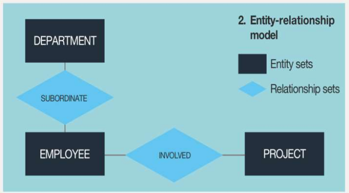

# 1. Index

# 2. Building a Department Management System

Before designing the solution, we must first understand and formalize what the customer
needs.

1. **Requirements Elicitation and Definition**: Collect needs, goals and
   constrains to turn them into functional and non-functional requirements.
2. **Use Case Definition**: describe actors, scenarios and what the system
   must provide.
3. **Analysis and Data Modeling**: Identify the main data structures, procedures
   and relationships.
4. **Design Refinement**: Refine the analysis into the _project workflow_,
   including a possible DB design.
5. **Implementation and Test**: Implementation of the chosen design and
   verification that requirements are satisfied.
6. **Deployment**

The role of the engineer is to identify the most suitable:

- **Software and Hardware Architecture**: The architecture must be suitable
  for the problem domain and the expected load.
- **Programming Languages and Development Environment**: The languages and
  tools must be suitable for the problem domain and the expected load.
- **Database Management System**: The DBMS must be suitable for the problem
  domain and the expected load.

## Requirements

To make this decision we need to take into account:

- **Functional Requirements**: describe the main functionalities of the
  application. Usually address inputs, outputs, user/system interactions,
  business rules, if/then behaviour.
- **Non-Functional Requirements**: describe quality attributes and constrains of
  the system. Might address performance, security, maintainability, scalability,
  availability, reliability, usability, etc. They can be classified in three
  categories:
  - **Product Requirements**: describe the quality attributes of the system.
    (speed, reliability, capacity, etc.)
  - **Organizational Requirements**: describe the constraints imposed by the
    organization. (process, standards, etc)
  - **External Requirements**: describe the constraints imposed by external
    entities. (legal, regulatory, etc.)

## Use Cases

A _use-case_ is a formal, scenario-based description of how _actors_ interact
with the system.

An **actor** is a user (or outside system) that interacts with the system to
obtain value.

It can be a human, a peripheral devise, an external system or even a scheduled
timed event.

When describing the relationship between different _use cases_ we talk about two
key concepts:

- `<<include>>`: the base use case **includes the behavior of the other**.
  It is used to avoid repetition.
- `<<extend>>`: the base use case **can be extended by the behavior of the other**.
  It is used to describe optional behavior.

To understand whether to use the first or the second relation try asking the question:
"Does the base use case make sense without the other?" If the answer is yes,
then it is an `<<extend>>` relationship, otherwise it is an `<<include>>` relationship.

## Data Modeling

Is a structured and formal description of the data and the relationships required
by an information system.

Before event thinking about SQL tables, from the requirements we must identify:

- **Entities**
- **Relationships** between entities. The relationships have a _cardinality_
  and can be classified as:
  - **One-to-One**: Each entity in the relationship can be associated with at
    most one entity in the other entity set.
  - **One-to-Many**: An entity in the relationship can be associated with
    multiple entities in the other entity set, but each entity in the other set
    can be associated with at most one entity in the first set.
  - **Many-to-Many**: Entities in both sets can be associated with multiple
    entities in the other set.
- **Attributes** of entities and relationships

After identifying these three elements we can create an **Entity-Relationship
(ER) Diagram** or a **Graph-Bases Model**.

Aside from ER Diagrams, we also use **UML Diagrams** to describe the system, included
additional entities, generalization, and explicit relationship cardinalities.

## Mockups

In order for the client to better understand the system, the engineer can create
**a mockup of the system**. A mockup is a visual representation of the system's
user interface, showing how the system will look and function. It helps
stakeholders visualize the end product and provides a basis for discussion and feedback.

For this step, artificial intelligence can be used to generate a first draft
that the end user can start to interact with.
